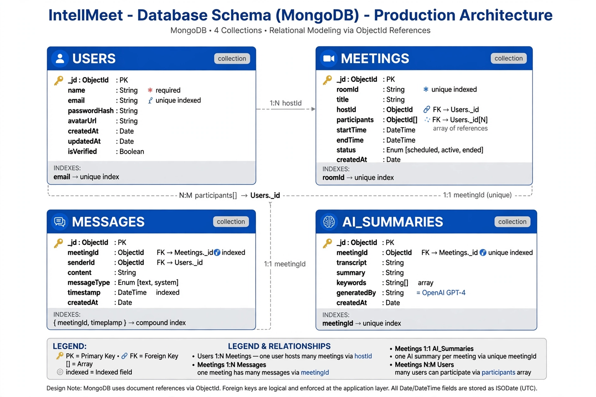
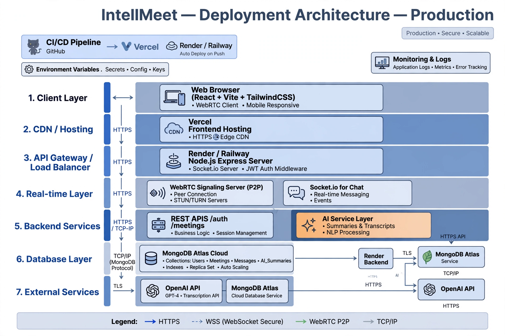
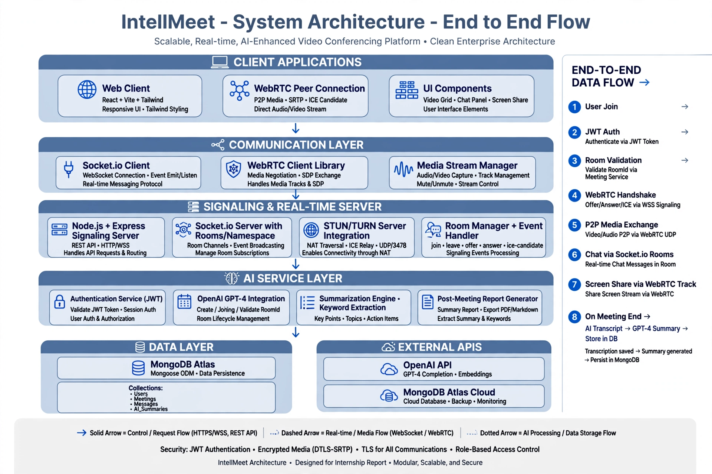
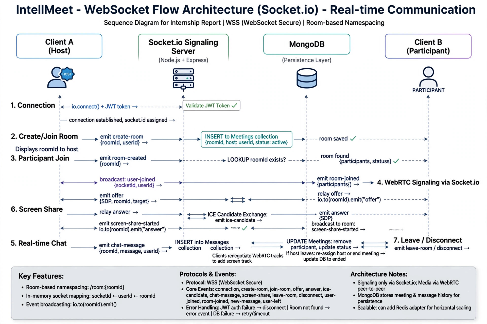

# IntellMeet - Architecture Documentation

## 1. Database Schema Architecture
MongoDB with 4 collections and indexing for production scalability.

## 2. Deployment Architecture
7-layer cloud-native deployment on Vercel, Render, MongoDB Atlas.

## 3. System Architecture - End to End Flow
Complete flow from client join to AI summary generation.

## 4. WebSocket Flow Architecture
Real-time communication via Socket.io with WebRTC signaling relay.

